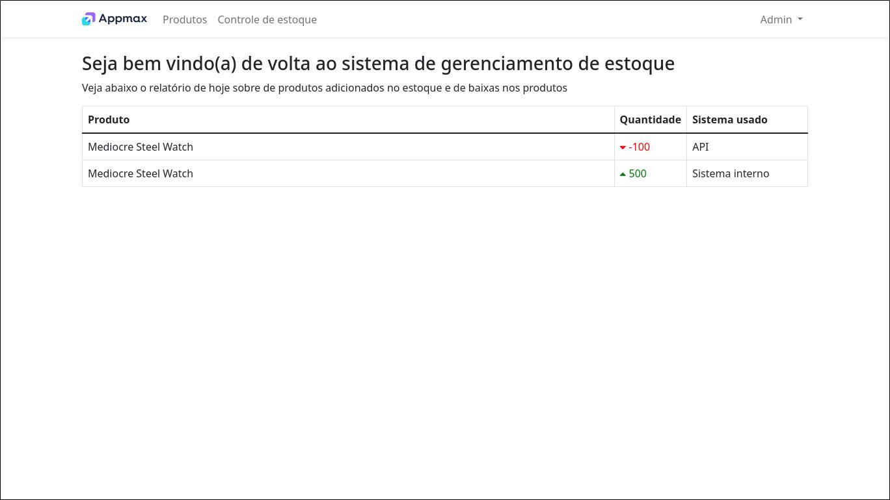
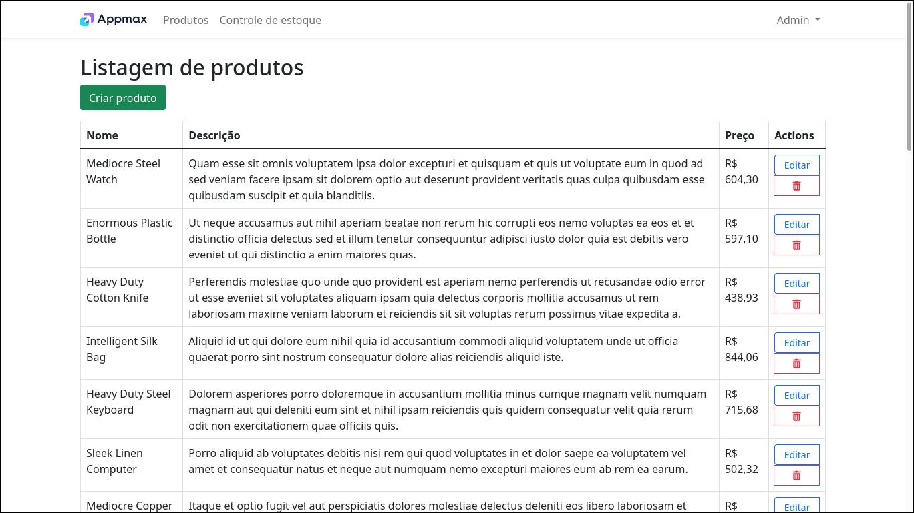
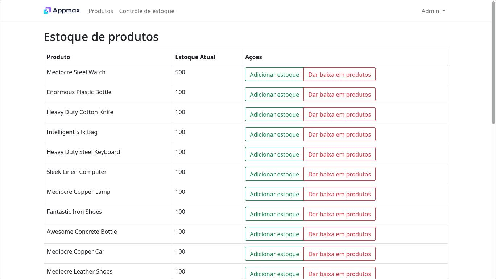

# Projeto de Gerenciamento de produtos
Esse projeto consiste em um CRUD de produtos, com uma api que tem dois endpoints, que permitem ao user autênticado adicionar produtos ao estoque, ou então dar baixa nesses produtos. Além de fazer isso pela API, o user também pode fazer esse gerenciamento de estoque dentro do próprio sistema.

O setup é feito com docker, então é preciso ter o docker e docker-compose instalados na máquina.

Será necessário prencher os campos do banco de dados no arquivo .env (o docker-compose precisa dessas variaveis para criar o banco de dados), e também é necessario preencher os campos USER e UID no final do .env, que são o nome do user e o ID dele.

O projeto usa PHP8.

## Setup
Primeiro rode o comando abaixo para rodar os containers e fazer build do Dockerfile
```docker
docker-compose up -d
```
Logo depois será preciso baixar as dependencias do Laravel usando o composer

```docker
docker-compose exec app composer update
```

Após baixar as dependencias, será preciso rodar as migrations
```docker
docker-compose exec app php artisan migrate
```
caso o container do laravel não consiga se conectar no container do mysql, espere alguns segundos e tente novamente.

E caso você queira popular as tabelas do banco de dados com o Seeder, rode esse comando
```docker
docker-compose exec app php artisan db:seed
```
Quando você rodar o Seeder ele irá criar um User com o email "admin@email.com" e senha "password". Use isso para fazer seu login.

### Testes
Existem 4 classes de teste na pasta tests. Uma de testes de integração do CRUD, um teste unitário de uma função desse CRUD. Uma classe que testa os endpoints de gerenciamento de estoque da API, e outra classe que testa o gerenciamento de estoque feito dentro do sistema.

Para rodar os testes basta rodar o comando
```docker
docker-compose exec app php artisan test
```


## Informações
O phpmyadmin está rodando na porta 8000, então é possivel acessar ele pelo localhost:8000.
O container do NGINX está rodando na porta 80, então basta acessar localhost para entrar no sistema

Dentro da homepage você irá ver um relatório de todas as adições e remoções de estoque que aconteceram no dia


Clicando na aba Produtos você verá uma listagem de produtos e poderá editar, remover e adicionar produtos


E clicando em Controle de Estoque você será redirecionado para uma página que te permite adicionar o estoque de um produto, ou dar baixa nesse estoque de produtos
